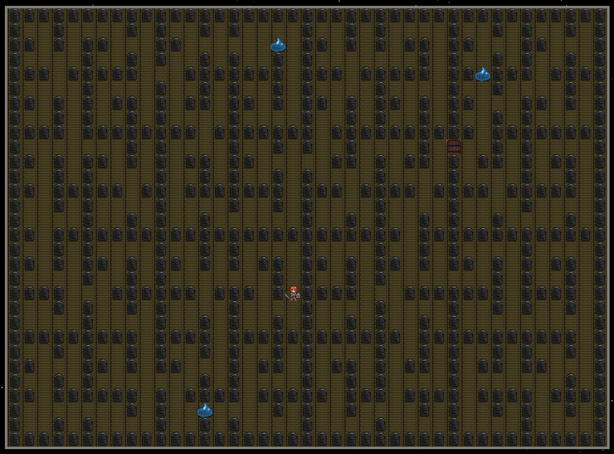
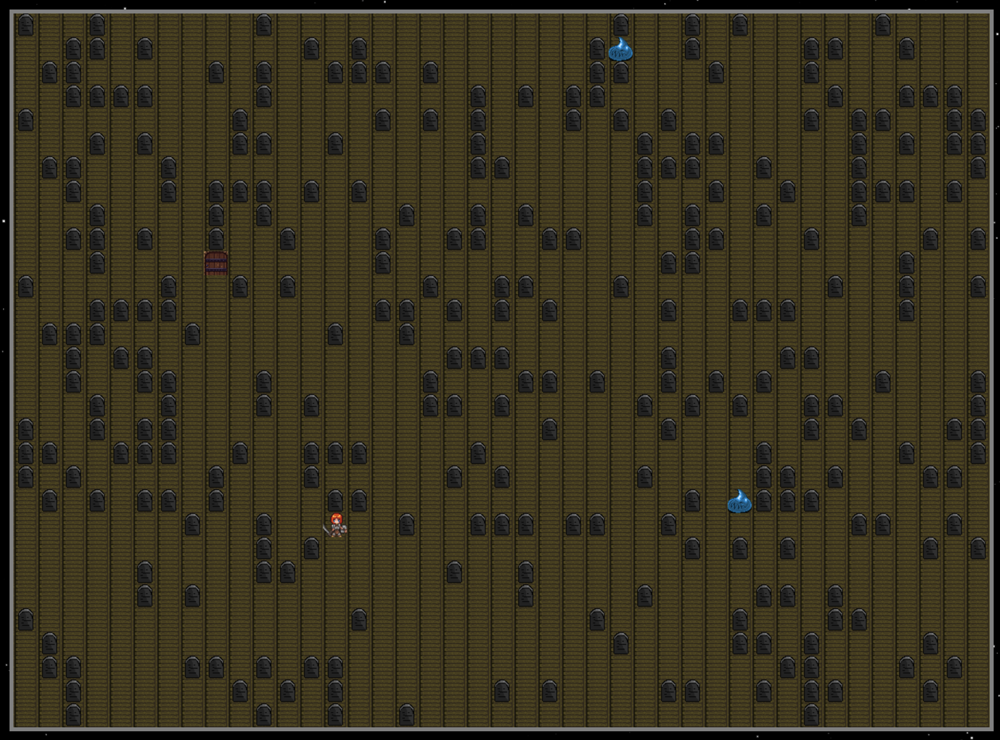
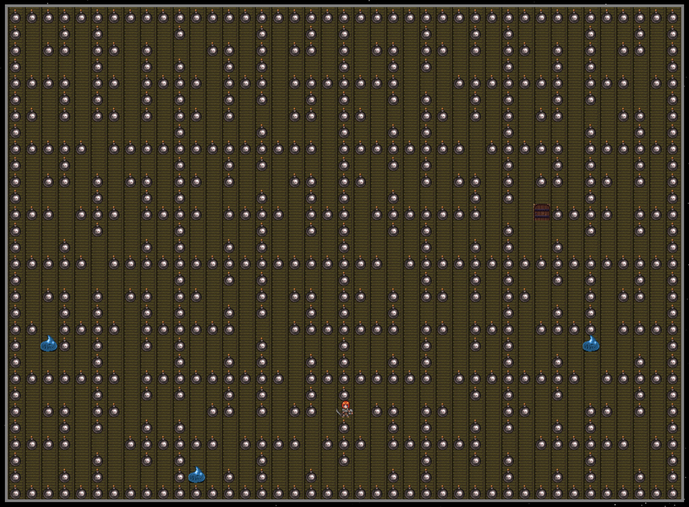
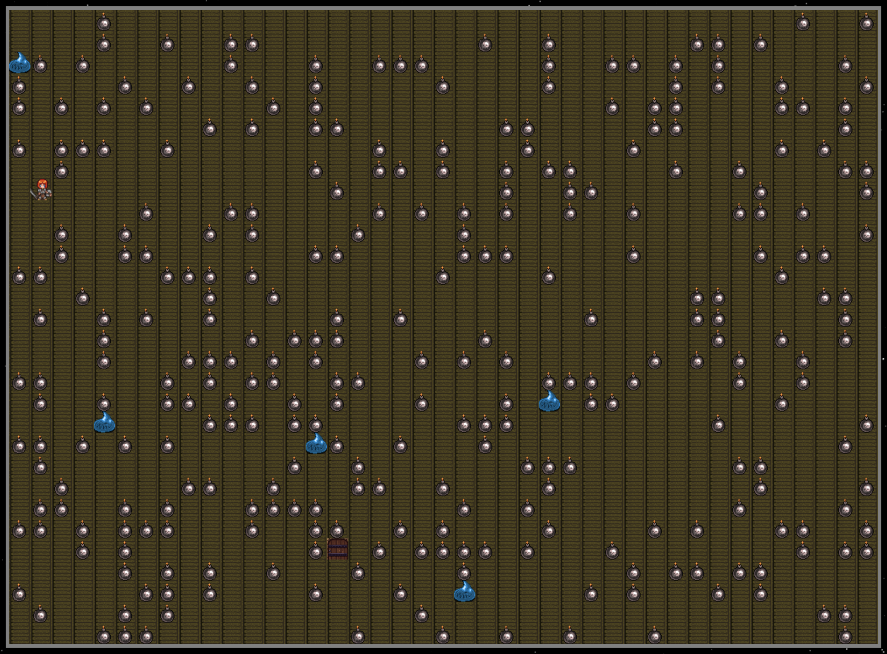

# Maze Runner
## Purpose of this project
* To learn graph algorithms and its implementations.
## Algorithms used
* Dijkstra, A Star, Recursive Backtracker Algorithm
## Technologies used
* HTML5, CSS, Javascript, Canvas, Bootstrap 4, annyang, speech synthesizer
## Demos

## Game options

### Maze types
#### Wall
* Recursive

* Random

#### Bomb
* Recursive

* Random

## Tutorial

## Voice commands

