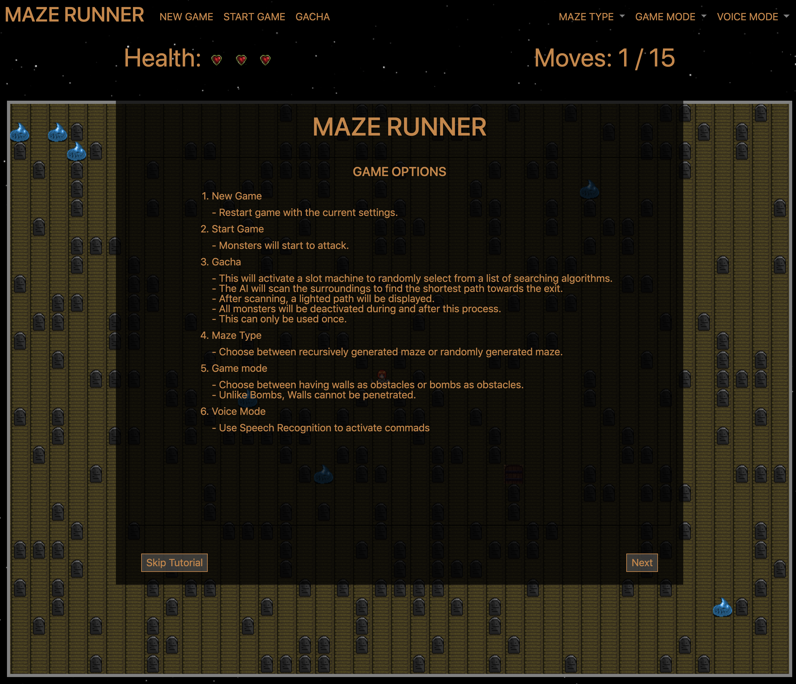
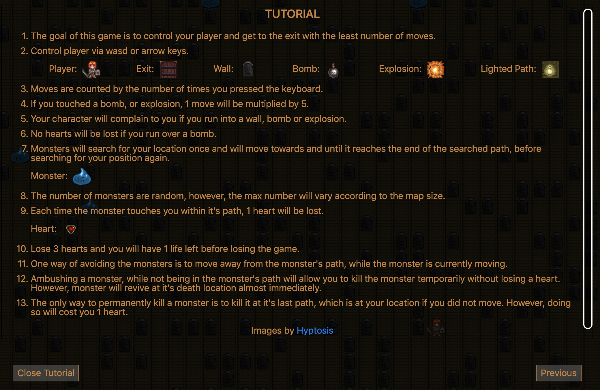

# Maze Runner
## Purpose of this project
* To learn graph algorithms and its implementations.
## Algorithms used
* Dijkstra, A Star
## Technologies used
* HTML5, CSS, Javascript, Canvas, Express, EJS, dotenv
## How to get it running
* Use package.json to install.
> npm install
## Game features

## Tutorial

